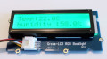

# IOT and Raspberry Pi

## Home Heating Monitor

We are going to track the environmental conditions in the room and (hopefully)
log the data we collect to a database.

It will be best if at least one person in the group has done a database
course.

### Objective
The Home Heating Monitor consists of two parts.
#### First Part: Sensor and Database Server

The first part is a Raspberry Pi Model B connected to a DHT22 temperature and humidity sensor.

Termerature and humidity data is sent to a MySQL database which runs in the Raspberry Pi.

#### Second Part: Temperature and Humidity Display
The second Raspberry Pi is fitted with a two-line LCD display.  The display shows the latest temperature and humidity readings from the database in the first Raspberry Pi.

### Assembly

#### Kit of Parts

For this project you will need:

  * 2 x Raspberry Pi
  * Grove Pi
  * DHT sensor
  * Either of:  
    * GrovePi Hat and GrovePi LCD Display and Grove Connection Wires or
    * Adafruit LCD Kit
  * Ethernet connection or WiFi for the Raspberry Pi
  * GibLab Repository for Instructions and code.

The Raspberry Pi you will be using has built in WiFi so you won’t need the
WiFi adapter shown in the picture

Raspberry Pi Model B+

.

Either a GrovePi Hat and LCD display

 

or an Adafruit LCD Kit.

#### Senor and Database Server
Start with the assembly of the Raspberry Pi which reads the temperature and humidity data and which acts as a database server.

Set up the first Raspberry Pi following the instructions in the Week 10 laboratory notes.

When this is complete, power the Raspberry Pi down.

The DHT22 sensor has three wires attached to it:

 * VCC: 3.5 volt power
 * GND: 0 volts or earth
 * DAT: Data

You should attach these wires to the General Purpose Input Output (GPIO) pins of the Raspberry Pi.  Take care to connect the wires correctly.  Equipment can be damaged by incorrect connections.  To help you, here is a diagram showing the Pi's GPIO pin layout.

Attach the wires in this way:

 * VCC to Pin 1 - 3v3
 * GND to Pin 9 - Ground
 * DAT to Pin 7 GPIO4

Leave the Raspberry Pi powered off until you have set up the second Pi.

#### GrovePi Display

Set up the second Raspberry Pi following the instructions in the Week 10 laboratory notes.

When this is complete, power the Raspberry Pi down.

Attach the GrovePi Hat to the Raspberry Pi, making sure the pins on the Pi match the sockets on the Hat.

Attach the LCD display as shown here:

#### Adafruit LCD

Set up the second Raspberry Pi following the instructions in the Week 10 laboratory notes.

When this is complete, power the Raspberry Pi down.

Attach the Adafruit LCD Kit to the Raspberry Pi, making sure the pins on the Pi match the sockets on the Kit.

## Moving On

Move on to the README2.MD file to set up the software and database on the Sensor and Database Server Raspberry Pi.
