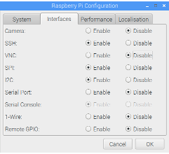

# Set up Sensor and Database Server
You have just worked through the set of instructions in README.MD.  You should have the temperature and humidity sensor set up and the Raspberry Pi powered down.  Power on the Pi (attach to as screen and keyboard if necessary).  I'm assuming you updated the operating system software as you installed the OS.  If not, do so now.

~~~
sudo apt update
sudo apt upgrade
~~~
This process will take some time, so you could start on setting up the display Pi while you wait.  Follow the instructions on **README3.MD**
## Set up Raspberry Pi interfaces
By default, the installation process on the Raspberry Pi does not set up everything as you need it.  We will now do this setup.

From the Pi menu select "Preferences -> Raspberry Pi Configuration"  Change the "Interfaces" tab to look like this:  
  
Now you will be able to access the Pi using SSH and Filezilla from a Lab Windows computer and the Pi will be able to "talk" to the sensor.

## Install and set up MySQL RDBMS
### Install software
Install the MySQL RDBMS and the Python MySQL libraries this way:

~~~
sudo apt install mysql-server python3-mysql.connector
~~~

### Configure RDBMS for network access
You need to edit a configuration file before the MySQL server will listen to the network.

~~~
sudo nano /etc/mysql/mariadb.conf.d/50-server.conf

~~~
Find the line:

~~~
bind-address-127.0.0.1
~~~
to

~~~
bind-address=0.0.0.0
~~~
You may remember that an IP address 0.0.0.0 means all IP addresses or any host on any network.

Now restart the server:

~~~
sudo systemctl restart mysqldb
~~~

### Set up database user
Connect to the database using the MySQL client:

~~~
sudo mysql -u root
~~~

Now you are connected to the database server, you will set up the database you will use.

~~~
CREATE DATABASE inte2043;
~~~

You will set up the user you will be using:

~~~
CREATE USER 'inte2043'@'localhost' IDENTIFIED BY 'Business_IT';
CREATE USER 'inte2043'@'%' IDENTIFIED BY 'Business_IT';
GRANT ALL PRIVILEGES ON inte2043.* TO 'inte2043'@'localhost';
GRANT ALL PRIVILEGES ON inte2043.* TO 'inte2043'@'%';
FLUSH PRIVILEGES;

~~~
Disconnect with the command:

~~~
quit
~~~
Now see if you can log in with the **inte2043** user:

~~~
mysql -u inte2043 -p
~~~
After typing the password, "Business_IT", you should be greeted with:

~~~
Welcome to the MariaDB monitor.  Commands end with ; or \g.
Your MariaDB connection id is 5
Server version: 10.1.37-MariaDB-0+deb9u1 Raspbian 9.0

Copyright (c) 2000, 2018, Oracle, MariaDB Corporation Ab and others.

Type 'help;' or '\h' for help. Type '\c' to clear the current input statement.
~~~
Now select the database you will use:

~~~
connect inte2043;
~~~
to show:

~~~
Connection id:    6
Current database: inte2043
~~~
## Create a Table
You need a table to store data.  The following instructions will set up a table to allow the database to work with the software you will be using.

You can use SQLyog (installed on lab PCs) to do this job.  You just need to know the IP address of the database server Pi.  Or you can just use the MySQL client.

The table will have four columns:
An ID which will also be the primary key
A timestamp
Temperature (real)
Humidity (real)
The SQL will be something like this:

~~~
CREATE TABLE inte2043.environment (
  id BIGINT UNSIGNED NOT NULL AUTO_INCREMENT,
  record_timedate TIMESTAMP NOT NULL DEFAULT CURRENT_TIMESTAMP,
  temperature FLOAT NOT NULL,
  humidity FLOAT NULL,
  PRIMARY KEY (id));
~~~

## Get the software
### Get Python libraries ###
You need some Python libries to work with the sensor hardware.  This software is in the GitLab repository.  [http://ula.its.rmit.edu.au:1080/ians/adafruit_python_dht](http://ula.its.rmit.edu.au:1080/ians/adafruit_python_dht).

Follow the instructions on README.MD.  ***Make sure you follow the instructions for Python 3 - NOT Python 2***

## Get the application ##
The software is on the Gitlab server.  You will download the software using **git**.  Find a convenient location on the Pi to carry out these commands.

~~~
git clone http://ula.its.rmit.edu.au:1080/ians/home-weather-station.git
~~~
**cd** to the directory that the **clone** command created.  The program you need to use is **Home_Weather_Sensor_mysql.py**.  
## Run the software ##

I'll leave it to you to work out how to run Python programs.  Dr Google may able to help if you can't work it out.

The program is set up to read the humidity and temperature every 10 minutes.

Once the program has been running for a minute or two, you should be able run an SQL SELECT statement to see that some data has been stored in the database.
# Next #
When you have all this working. you should move on to READM3.MD
